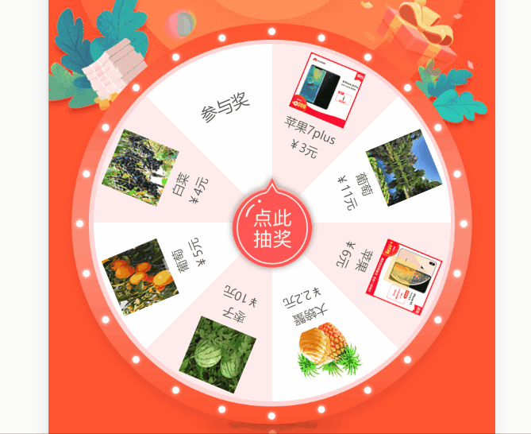

## 大转盘

> 这是一个大转盘抽奖组件，可以自定义盘面，包括颜色、字体、图片等内容。

感谢[@木子七](https://github.com/muzqi)大佬的大转盘文章[这里是连接](https://juejin.im/post/5992b6065188257dd3664dbc)，在之后的使用中发现不能设置奖品并将奖品转动到对应的扇形盘面上，对此我进行了修改，使其可以在`vue`中正常使用，可能修改的并不好，希望各位指出。

实现过程我就不再重复编辑了，木子七大佬的文章中以及他的github中对大转盘的实现有详细的描述以及代码实现。在此我只对我改进的部分代码进行示例以及解释。

##### 一、解决大转盘清晰度

1. 方案1：该方案出自[@boluobanana的简书文章](https://www.jianshu.com/p/2cd5143cf9aa)，非常感谢大佬。

    ``` javascript
    /**
     * Writes an image into a canvas taking into
     * account the backing store pixel ratio and
     * the device pixel ratio.
     *
     * @author Paul Lewis
     * @param {Object} opts The params for drawing an image to the canvas
    */
    function drawImage(opts) {
    
        if(!opts.canvas) {
            throw("A canvas is required");
        }
        if(!opts.image) {
            throw("Image is required");
        }
    
        // get the canvas and context
        var canvas = opts.canvas,
            context = canvas.getContext('2d'),
            image = opts.image,
    
            // now default all the dimension info
            srcx = opts.srcx || 0,
            srcy = opts.srcy || 0,
            srcw = opts.srcw || image.naturalWidth,
            srch = opts.srch || image.naturalHeight,
            desx = opts.desx || srcx,
            desy = opts.desy || srcy,
            desw = opts.desw || srcw,
            desh = opts.desh || srch,
            auto = opts.auto,
    
            // finally query the various pixel ratios
            devicePixelRatio = window.devicePixelRatio || 1,
            // backingStoreRatio此属性已被弃用
            //  backingStoreRatio = context.webkitBackingStorePixelRatio ||
            context.mozBackingStorePixelRatio ||
                context.msBackingStorePixelRatio ||
                context.oBackingStorePixelRatio ||
                context.backingStorePixelRatio || 1,
    
                // ratio = devicePixelRatio / backingStoreRatio;
                ratio = devicePixelRatio;
    
        // ensure we have a value set for auto.
        // If auto is set to false then we
        // will simply not upscale the canvas
        // and the default behaviour will be maintained
        if (typeof auto === 'undefined') {
            auto = true;
        }
    
        // upscale the canvas if the two ratios don't match
        // if (auto && devicePixelRatio !== backingStoreRatio) {
        if (auto && devicePixelRatio) {
            var oldWidth = canvas.width;
            var oldHeight = canvas.height;
    
            canvas.width = oldWidth * ratio;
            canvas.height = oldHeight * ratio;
    
            canvas.style.width = oldWidth + 'px';
            canvas.style.height = oldHeight + 'px';
    
            // now scale the context to counter
            // the fact that we've manually scaled
            // our canvas element
            context.scale(ratio, ratio);
    
        }
    
        context.drawImage(pic, srcx, srcy, srcw, srch, desx, desy, desw, desh);
    }
    ```

2. 方案2：精简版代码

    ``` javascript
    let getPixelRatio = function (context) {
        let backingStore = context.backingStorePixelRatio ||
            context.webkitBackingStorePixelRatio ||
            context.mozBackingStorePixelRatio ||
            context.msBackingStorePixelRatio ||
            context.oBackingStorePixelRatio ||
            context.backingStorePixelRatio || 1;
        return (window.devicePixelRatio || 1) / backingStore;
    };
    
    let ratio = getPixelRatio(context);
    let fontSize = document.getElementsByTagName("html")[0].style.fontSize.split("px")[0] || 100;
    
    canvas.style.width = canvas.width / fontSize + 'rem';
    canvas.style.height = canvas.height / fontSize + 'rem';
    
    canvas.width = canvas.width * ratio;
    canvas.height = canvas.height * ratio;
    
    // 放大倍数
    context.scale(ratio, ratio);
    ```

    以上两个方案均能解决`canvas`在高分屏上绘制出现模糊的问题。

##### 二、预加载盘面图片

在canvas中有多种加载图片的方式，常用的有以下两种方式：

1. 方式一：通过`new Image()`声明一个`Image`对象，并通过`src`设置图片路径

   ``` javascript
   // 声明一个Image()对象
   let img = new Image();
   
   // 设置Image对象的src
   img.src = "path/icon.png";
   
   // 在canvas中绘制图片
   ctx.drawImage(img, 0, 0, imageWidth, imageHeight);
   ```

2. 方式二：首先通过``标签向`html`中插入一张图片，然后使用`getElementById`获取这个`img`元素，再执行绘图

   ``` html
   <!-- 在html页面中插入img元素 -->
   <body>
       
   </body>
   ```

   ``` javascript
   // 获取页面中的html元素
   let img = document.getElementById("img");
   
   // 在canvas中绘制图片
   ctx.drawImage(img, 0, 0, imageWidth, imageHeight);
   ```

讲到这里，有必要提一下这里碰到的一个问题，通过方式一在`canvas`中绘图一张图片时，发现并不能成功绘制，而通过方式二绘制的时候却能正常显示。

这是因为`canvas`在绘制图片的时候需要 <font color=red>等图片加载成功之后才可以进行绘制，`drawImage()`这个方法在图片未加载完成的时候是不会被调用的，所以导致了绘图失败。</font>

我们该如何解决这个问题呢？我百度并尝试了多种方式，最后总结了三种方法用于解决这个问题：

1. 方法一：``标签和`window.onload`配合使用

   ``` html
   <!-- html代码 -->
   
   ```

   ``` javascript
   // JavaScript代码
   window.onload = function() {
       context.drawImage();
   }
   ```

   或者在后期插入标签：

   ``` javascript
   let img = document.createElement("img");
   img.src = "path";
   document.body.appendChild(img);
   context.drawImage(img, 0, 0, width, height);
   ```

2. 方法二：使用`定时器setTimeout()`异步实现

   ``` javascript
   setTimeout(function() {
       context.drawImage(img, 0, 0, width, height);
   }, 10)
   ```

   > 延迟时间需要根据不同的情况设定，所以用定时器去解决这个方案是有弊端的，不能保证定时器时间到了之后图片能正常加载，若出现网络较差的情况还是会遇到无法加载的情况。

3. 方式三：使用`img.onload`监听图片加载结束

   ``` javascript
   img.onload = function(){
       console.log('图片加载成功');
       console.log(this);
       context.drawImage(img, 0, 0, width, height);
   }
   ```

   > 使用`onload`监听`img`的加载，加载结束之后再执行图片的绘制，目前最靠谱的方式就是这个。
   >
   > 需要注意的是`onload`是一个异步任务。

   我使用的是`img`标签加`onload`监听图片加载的方式

   ``` html
   <!-- html代码 -->
   
   ```

   ``` javascript
   // JavaScript代码
   let img = document.getElementById("img"); //获取img
   img.onload = function() { //监听img是否加载结束
       console.log('图片加载成功');
       console.log(this);
       context.drawImage(img, 0, 0, width, height); //绘制图片
   }
   ```

##### 三、大转盘盘面相关修改

1. 去掉[@木子七](https://github.com/muzqi)大佬原来的触发按钮以及使用`canvas`绘制的指针，并添加一个透明的`div`用于给用户"点击"。

   ```html
   <template>
     <div class="canvas-main">
       <div id="spin_button"></div>
       <!-- 这是一个透明的“点击”按钮 -->
       <div id="spin_button_mask"
            @click="clickBtn"></div>
       <canvas id="canvas"
               width="300"
               height="300">
       </canvas>
       <div style="display: none">
         
         
         
         
         
         
         
         
         
       </div>
     </div>
   </template>
   <!-- 在<canvas>标签中添加文字说明，用于当浏览器不兼容canvas标签的时候的提示 -->
   ```

2. 加载转盘奖品图片和按钮图片

   ``` javascript
   // ---- 加载所有图片，目前是写死用的，可以删除
   // 因为onload是异步操作，故每加载一张图片则令imgFlag加一，当imgFlag === 9的时候说明9张图片加载完毕，    此时可以开始绘制转盘
   // 加载按钮图片
   let btn_img_red = document.getElementById(`pointer-red`);
   let btn_img_gray = document.getElementById(`pointer-gray`);
   
   let imgFlag = 0;
   let imgs = []; //此数组用于暂存奖品图片
   
   awards.forEach((item, index) => { //遍历奖品数组并加载奖品图片
       if (item.img) {
           let imgObj = document.getElementById(`prize${index + 1}`);
           imgs.push(imgObj);
           imgObj.onload = function () {
               imgFlag++;
               if (imgFlag >= 9) { //判断一共9张图片是否全部加载完毕
                   console.log("开始绘制盘面");
                   drawRouletteWheel();
               }
           }
       } else {
           imgs.push(null)
       }
   });
   
   btn_img_red.onload = function () {
       imgFlag++;
       if (imgFlag >= 9) { //判断一共9张图片是否全部加载完毕
           console.log("开始绘制盘面");
           drawRouletteWheel();
       }
   };
   btn_img_gray.onload = function () {
       imgFlag++;
       if (imgFlag >= 9) { //判断一共9张图片是否全部加载完毕
           console.log("开始绘制盘面");
           drawRouletteWheel();
       }
   };
   ```

3. 绘制盘面相关内容，如奖品名称、奖品价格、奖品略缩图等

   ``` javascript
   /**
   * 绘制转盘
   */
   function drawRouletteWheel() {
       // ----- ① 清空页面元素，用于逐帧动画
       context.clearRect(0, 0, canvas.width, canvas.height);
       // -----
       for (let i = 0; i < awards.length; i++) {
           let _startRadian = startRadian + awardRadian * i, // 每一个奖项所占的起始弧度
               _endRadian = _startRadian + awardRadian; // 每一个奖项的终止弧度
   
           // ----- ② 使用非零环绕原则，绘制圆盘
           context.save();
           if (i % 2 === 0) {
               context.fillStyle = "#ffedee"
           } else {
               context.fillStyle = "#ffffff"
           }
           context.beginPath();
           context.arc(canvas.width / 2 / ratio, canvas.height / 2 / ratio, OUTSIDE_RADIUAS, _startRadian, _endRadian, false);
           context.arc(canvas.width / 2 / ratio, canvas.height / 2 / ratio, INSIDE_RADIUAS, _endRadian, _startRadian, true);
           context.fill();
           context.restore();
           // -----
   
           // ----- ③ 绘制文字
           context.save();
   
           if (awards[i].img) {
               context.font = _this.fontSize + "px bold";
           } else {
               context.font = _this.fontSize + 4 + "px bold";
           }
   
           context.fillStyle = "#5e5d5d";
   
           context.translate(
               CENTER_X + Math.cos(_startRadian + awardRadian / 2) * TEXT_RADIUAS,
               CENTER_Y + Math.sin(_startRadian + awardRadian / 2) * TEXT_RADIUAS
           );
           context.rotate(_startRadian + awardRadian / 2 + Math.PI / 2);
   
           // 绘制图片，默认奖品在偶数位
           if (awards[i].img && imgs[i]) {
               // context.drawImage(bgImg, -context.measureText(awards[i].name).width / 2,0,50,50);
               context.drawImage(imgs[i], -25, -65, 50, 50);
           }
   
           // 名称 当奖品带有图片的时候调整字体绘制位置和大小等相关属性
           if (awards[i].img) {
               if (awards[i].AwardName.length > 10) {
                   context.fillText(awards[i].AwardName, -context.measureText(awards[i].AwardName).width / 2, -5 * (awards[i].AwardName.length - 10));
               } else {
                   context.fillText(awards[i].AwardName, -context.measureText(awards[i].AwardName).width / 2, 0);
               }
           } else {
               context.fillText(awards[i].AwardName, -context.measureText(awards[i].AwardName).width / 2, -20);
           }
           // 价格
           if (awards[i].MdseAmount) {
               context.fillText(awards[i].MdseAmount, -context.measureText(awards[i].MdseAmount).width / 2, 16);
           }
           context.restore();
           // -----
   
       }
   
       // -----④绘制按钮
       if (!_this.disabled) { //disabled是控制"开始旋转"按钮是否可以点击的参数，当可以点击的时候绘制红色的按钮，当不可点击的时候绘制灰色的按钮
           context.drawImage(btn_img_red, canvas.width / 2 / ratio - btn_img_red.width / 2 / ratio * 1.5, canvas.height / 2 / ratio - btn_img_red.height / 2 / ratio * 1.5, btn_img_red.width / ratio * 1.5, btn_img_red.height / ratio * 1.5)
       } else {
           context.drawImage(btn_img_gray, canvas.width / 2 / ratio - btn_img_gray.width / 2 / ratio * 1.5, canvas.height / 2 / ratio - btn_img_gray.height / 2.5 / ratio * 1.5, btn_img_gray.width / ratio * 1.5, btn_img_gray.height / ratio * 1.25)
       }
       // -----
   
       // ----- ④ 绘制指针 因指针使用自定义的按钮，并绘制在图片上，故原绘制指针的方法删除
       // context.save();
       // context.beginPath();
       // context.moveTo(CENTER_X, CENTER_Y - OUTSIDE_RADIUAS + 8);
       // context.lineTo(CENTER_X - 10, CENTER_Y - OUTSIDE_RADIUAS);
       // context.lineTo(CENTER_X - 4, CENTER_Y - OUTSIDE_RADIUAS);
       // context.lineTo(CENTER_X - 4, CENTER_Y - OUTSIDE_RADIUAS - 10);
       // context.lineTo(CENTER_X + 4, CENTER_Y - OUTSIDE_RADIUAS - 10);
       // context.lineTo(CENTER_X + 4, CENTER_Y - OUTSIDE_RADIUAS);
       // context.lineTo(CENTER_X + 10, CENTER_Y - OUTSIDE_RADIUAS);
       // context.closePath();
       // context.fill();
       // context.restore();
       // -----
   }
   ```

4. 开始旋转触发方法修改

   ``` javascript
   /**
   * 开始旋转
   */
   function rotateWheel() {
       // 当 当前时间 大于 总时间，停止旋转，并返回当前值
       spinningTime += 20;
       if (spinningTime >= spinTotalTime) {
           _this.disabled = false;
           _this.$emit('end'); //当转盘停止转动的时候触发end回调
           drawRouletteWheel(); //当结束的时候重新绘制一次转盘，保证按钮是可转动的状态对应的按钮
           return
       } else {
           _this.disabled = true;
       }
   
       let _spinningChange = (spinningChange - easeOut(spinningTime, 0, spinningChange, spinTotalTime)) * (Math.PI / 180);
       startRadian += _spinningChange;
   
       drawRouletteWheel();
       window.requestAnimationFrame(rotateWheel);
   }
   ```

5. 监听点击事件，开始旋转

   ``` javascript
   _this.$refs["spin_button"].addEventListener("click", () => {
       if (!_this.disable) { //控制抽奖次数的参数
           if (!_this.disabled) { //控制是否重复点击的参数
   
               // 获取奖品在数组中的下标
               if (getIndex() !== false) {
                   listIndex = getIndex();
               } else {
                   console.error("请确定中奖奖品是否在奖品列表中");
                   _this.clear = false;
                   return
               }
   
               function getIndex() {
                   let i = null;
                   let notWonIndex = null;
                   _this.list.forEach((item, index) => {
                       if (item.AwardNo) {
                           // if (_this.prize === item.AwardNo) {
                           //   i = index;
                           // } else if (item.AwardNo === "MDSE999999999999999") {
                           //   notWonIndex = index;
                           // }
   
                           if (_this.prize === item.AwardNo) {
                               i = index;
                           } else {
                               notWonIndex = index;
                           }
                       } else {
                           console.warn("请确认奖品编号字段是否存在")
                       }
                   });
                   if (!notWonIndex) {
                       console.warn("奖品编号不存在，自动设置为谢谢参与")
                   }
                   if (i !== null) {
                       return i;
                   } else {
                       return notWonIndex;
                   }
               }
   
               // 获取中奖奖品旋转的起始角度
               turnStartRadian = awardRadian * listIndex; // 获取中奖奖品的起始角度
               turnEndRadian = awardRadian * listIndex + awardRadian; // 获取中奖奖品的结束角度
   
               spinningTime = 0; // 初始化当前时间
               startRadian = 0;
               
               // 初始化弧度
               spinTotalTime = 5 * 1000; // 随机定义一个时间总量
   
               prizeAngle = awardRadian * 180 / Math.PI * Math.floor(Math.random() * 10 + 1) / 10; //该参数是确定奖品的对应角度(360°内)
   
               if (prizeAngle > 0.7 * (360 / _this.list.length)) {
                   prizeAngle = 0.7 * (360 / _this.list.length)
               } else if (prizeAngle < 0.3 * (360 / _this.list.length)) {
                   prizeAngle = 0.3 * (360 / _this.list.length)
               }
   
               spinningChange = (turnStartRadian * 180 / Math.PI - 90 * (listIndex + 1) % 360 - prizeAngle + 360 * turns) / 124.5; //根据相应的角度算出大转盘的旋转速率，保证转盘停止转动的时候能落在我们想落在的位置
               
               rotateWheel();
           } else {
               console.log('请勿重复点击')
           }
       } else {
           console.log('今日抽奖次数已用完')
       }
   });
   ```

   以上的修改均在`vue`的`mounted`生命周期之内进行，此时需要进行相应的修改，整个vue组件大概结构如下

   ``` javascript
   name: "Lottery",
   props: {
     // 获取数组
     disable: {
       type: Boolean,
       default: false
     },
     // 盘面奖品list
     list: {
       type: Array,
       default: (val) => {
         if (!val || val.length === 0) {
           console.error("请确认转盘盘面奖项列表")
         }
       }
     },
     // 设置中奖奖项
     prize: {
       type: String,
       default: null
     },
     // 设置奖品字体
     fontSize: {
       type: Number,
       default: 16
     },
     // 设置旋转圈数
     turns: {
       type: Number,
       default: 5
     },
     // 控制转盘转动
     run: {
       type: Boolean,
       default: false
     }
   },
   data() {
     return {
       disabled: false, //控制大转盘是否可以点击
     }
   },
   mounted() {
     this.$nextTick(() => {
       let _this = this; //将vue的this值赋予_this，目的是防止之后this被污染导致获取不到正确的值
       // ......对应的代码
     })
   },
   watch: {
     run(val) { //监听run的变化，当run变化的时候触发spin_button的click事件
       if (val && !this.disabled) {
         this.$refs["spin_button"].click();
       }
     }
   },
   methods: {
     // 点击按钮遮罩
     clickBtn() {
       if (!this.run && !this.disabled) {
         console.log("开始旋转");
         this.$emit('start')
         } else {
           console.error("请勿重复点击")
         }
     },
   }
   ```

##### 四、效果图



本文部分内容转载自[@木子七](https://github.com/muzqi)的[大转盘文章](https://juejin.im/post/5992b6065188257dd3664dbc)

